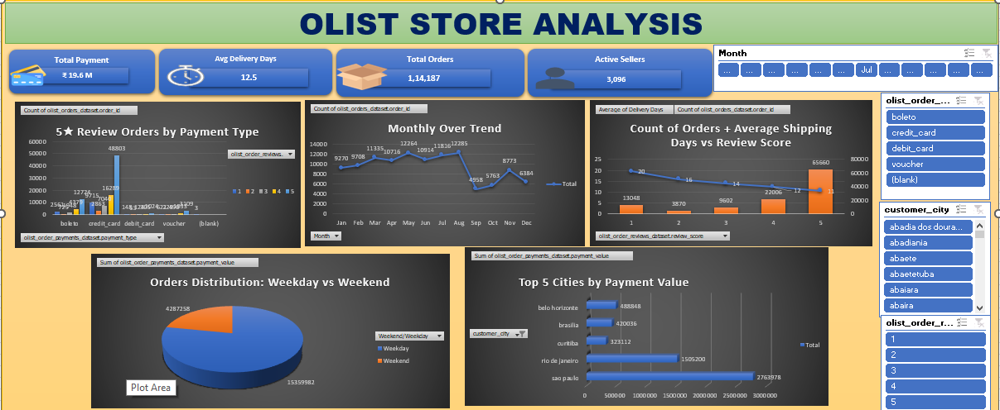
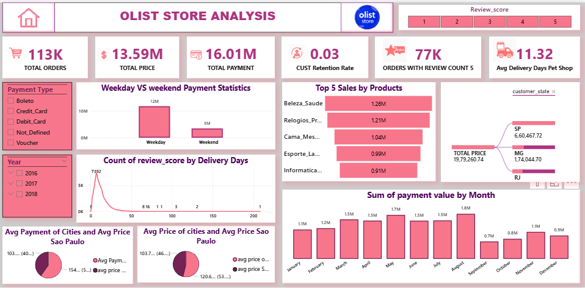
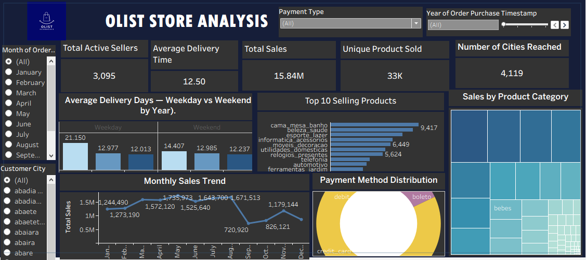

# Olist E-Commerce Analytics

## Tools Used
- SQL
- Excel
- Power BI
- Tableau

## Objective
To analyze Olist e-commerce data to understand sales trends, customer behavior, delivery performance, and seller performance, enabling data-driven business decisions.

## Dataset
Brazilian e-commerce public dataset by Olist containing customer, order, product, seller, payment, and delivery information.

## Key KPIs
- Total Orders
- Total Revenue
- Average Order Value
- Order Status Distribution
- Delivery Delay Analysis
- Top Products and Sellers
- Customer Segmentation

## SQL Analysis
- Data cleaning and validation
- Joining multiple tables
- KPI calculation using aggregate functions
- Business-focused insights

## Dashboards
- Excel Dashboard – Sales Overview
- Power BI Dashboard – Interactive KPIs
- Tableau Dashboard – Visual Storytelling

## Outcome
This project provides insights into customer behavior, delivery delays, and sales performance to support data-driven decision-making.

## Dashboard Previews

### Excel Dashboard – Sales Overview

### Power BI Dashboard – Interactive KPIs

### Tableau Dashboard – Visual Storytelling

